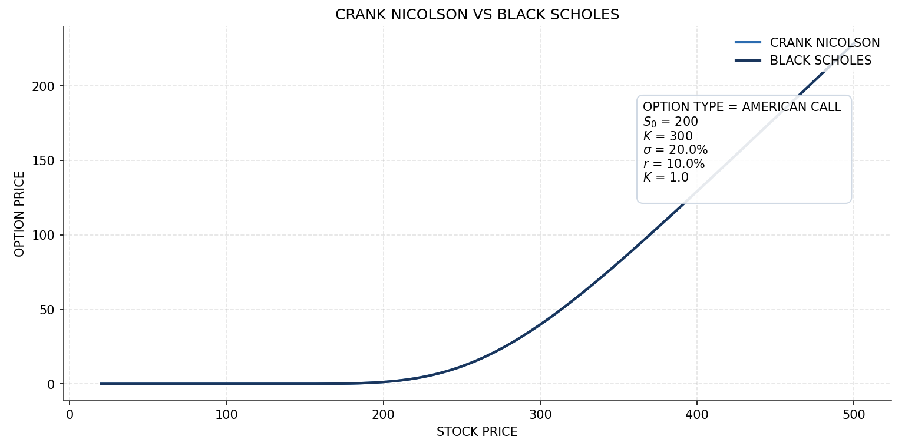
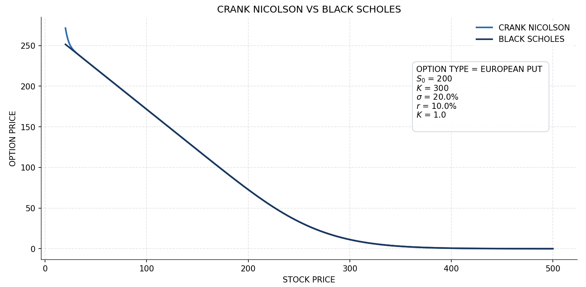
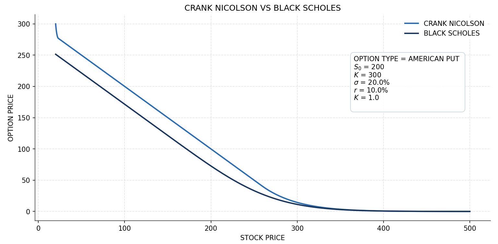
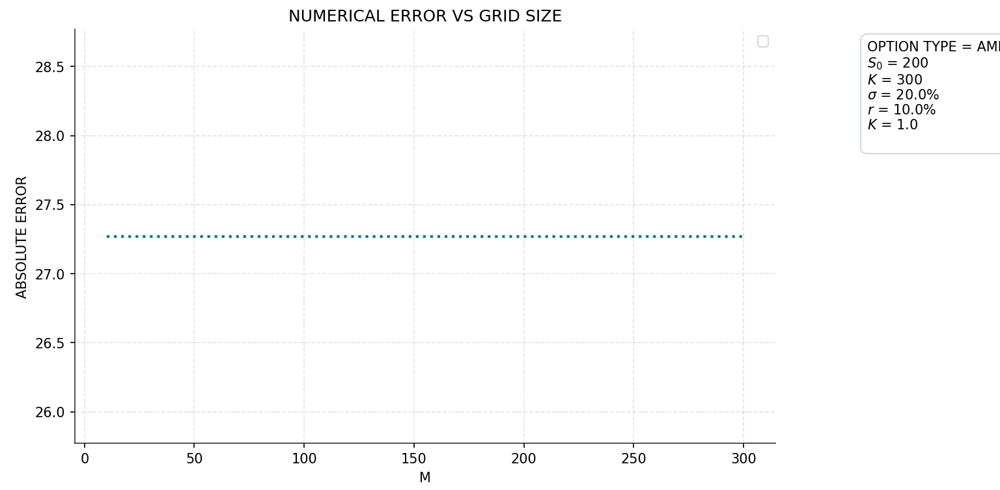

# Crank–Nicolson Option Pricer

A Python implementation of the **Crank–Nicolson finite-difference method** for pricing European and American options under the Black–Scholes framework.

The project focuses on understanding the numerical method, validating European option prices against Black–Scholes, and studying grid convergence.

## Features

- European Call and Put pricing
- American Call and Put pricing
- Crank–Nicolson finite-difference method
- Log-stock-price transformation
- Early exercise for American options
- Boundary conditions
- Black–Scholes validation
- Error and convergence analysis
- Pricing and convergence plots

## Mathematical Model

The Black–Scholes PDE with continuous dividend yield is

$$
V_t + (r-q)SV_S + \frac{1}{2}\sigma^2S^2V_{SS}
-rV = 0
$$

Using the log-price transformation

$$
Z=\ln(S)
$$

the PDE becomes

$$
V_t+
\left(r-q-\frac{1}{2}\sigma^2\right)V_Z
+\frac{1}{2}\sigma^2V_{ZZ}
-rV=0
$$

The spatial derivatives are approximated using central finite differences and the Crank–Nicolson method is used to solve the resulting linear system backward in time.

### Payoff

European and American options use the standard payoffs:

$$
V_{\text{Call}}(S,T)=\max(S-K,0)
$$

$$
V_{\text{Put}}(S,T)=\max(K-S,0)
$$

For American options, early exercise is applied at every time step:

$$
V=\max(V_{CN},V_{\text{exercise}})
$$

## Black–Scholes Validation

For European options, the numerical result is compared with the analytical Black–Scholes price.

For a European Call:

$$
C=Se^{-qT}N(d_1)-Ke^{-rT}N(d_2)
$$

For a European Put:

$$
P=Ke^{-rT}N(-d_2)-Se^{-qT}N(-d_1)
$$

where

$$
d_1=
\frac{\ln(S/K)+(r-q+\frac{1}{2}\sigma^2)T}
{\sigma\sqrt{T}}
$$

and

$$
d_2=d_1-\sigma\sqrt{T}
$$

The absolute error is

$$
\text{Error}=|V_{CN}-V_{BS}|
$$

For example:

```text
Crank–Nicolson : 13.2694
Black–Scholes  : 13.2697
Absolute Error : 0.00026
```

## Numerical Grid

The grid is uniform in log-stock-price space:

$$
\Delta Z=
\frac{\ln(S_{\max})-\ln(S_{\min})}{M}
$$

with time step

$$
\Delta t=\frac{T}{N}
$$

Increasing $M$ produces a finer spatial grid:

$$
M\uparrow \quad\Rightarrow\quad \Delta Z\downarrow
$$

This is used to study numerical convergence.

## Project Structure

```text
project/
├── Figures/
├─ numericals/
│   ├── __init__.py
│   ├── boundaries.py
│   ├── coefficients.py
│   ├── grid.py
│   ├── main.py
│   ├── matrix.py
│   ├── payoff.py
│   └── rhs.py
|   |── solver.py
├─ test and plotting/
│   ├── test_and_plotting.py
├── README.md
└── LICENSE
```

| File | Purpose |
|------|---------|
| `grid.py` | Creates stock-price and time grids |
| `payoff.py` | Calculates Call/Put payoffs |
| `coefficients.py` | Computes Crank–Nicolson coefficients |
| `matrix.py` | Builds the coefficient matrix |
| `rhs.py` | Builds the right-hand-side vector |
| `boundary.py` | Applies boundary conditions |
| `solver.py` | Solves the linear system backward in time |
| `main.py` | Runs the complete pricing workflow |
| `test_and_plotting.py` | Runs pricing, validation tests, generates pricing, error, and convergence figures |

## Workflow

The implementation follows:

```text
Input Parameters
      ↓
Numerical Grid
      ↓
Option Payoff
      ↓
Crank–Nicolson Coefficients
      ↓
Matrix + RHS
      ↓
Boundary Conditions
      ↓
Backward Time-Stepping
      ↓
Early Exercise (American)
      ↓
Option Price
      ↓
Validation & Analysis
```

## Figures

### European Option Price

The price curve compares the **Crank–Nicolson numerical solution** with the **Black–Scholes analytical solution** across the stock-price grid.

A close match indicates that the numerical implementation is behaving correctly.

### Numerical Error

The error plot shows the difference between the Crank–Nicolson and Black–Scholes prices for European options.

$$
\text{Error}=|V_{CN}-V_{BS}|
$$

The error is evaluated at the current stock price and can also be studied as the grid size changes.

### Convergence

The convergence plot shows how the numerical error changes as the spatial grid becomes finer.

A decreasing error with increasing $M$ indicates convergence of the numerical solution.

### American Options

For American options, the Crank–Nicolson method includes the early-exercise condition:

$$
V=\max(V_{CN},V_{\text{exercise}})
$$

This allows the numerical solution to capture the possibility of exercising before maturity.

## American Put vs. Black–Scholes

The **Black–Scholes formula prices a European Put**, while the numerical method prices an **American Put** with early exercise.

Therefore, the American Put price should **not** be compared directly with the Black–Scholes European Put as a pure numerical-error measurement.

Any difference may include the **early-exercise premium**.

The Black–Scholes value is therefore shown only as a reference. A binomial-tree or other independent American Put model would provide a more appropriate benchmark.

## Figures

### European Call

The Crank–Nicolson price closely follows the analytical Black–Scholes price.



### European Put

The numerical solution is compared with the Black–Scholes analytical price.



### American Call

The Crank–Nicolson method prices the American Call while accounting for early exercise.


### American Put

The American Put includes early exercise. The Black–Scholes European Put is shown only as a reference and is not a direct numerical-error benchmark.



### Convergence

The convergence plot shows how the numerical error changes as the spatial grid is refined.



## Limitations

- American Put convergence is not yet validated against an independent benchmark.

## Future Improvements

- Add a binomial-tree benchmark for American options
- Add Greeks such as Delta and Gamma
- Add more numerical validation tests

## License

This project is licensed under the **MIT License**.

## Disclaimer

This project is intended for **educational and research purposes only** and should not be considered investment advice or a production financial model.
